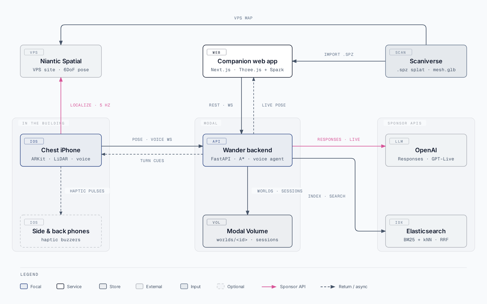

# Wander

**Indoor navigation for blind and low-vision travellers.** Wander turns a real building into a walkable 3D map and guides a person through it using a chest-worn iPhone, live obstacle cues, and a voice agent. A sighted helper can map the building in a browser and steer from anywhere.

Built at Hack the North by four people in one weekend. Not a replacement for the white cane — the layer it was never meant to cover.



## Contents

- [Inspiration](#inspiration)
- [What it does](#what-it-does)
- [How it works](#how-it-works)
- [How we built it](#how-we-built-it)
- [Repository layout](#repository-layout)
- [Running it](#running-it)
- [Challenges we ran into](#challenges-we-ran-into)
- [Accomplishments we're proud of](#accomplishments-were-proud-of)
- [What we learned](#what-we-learned)
- [What's next](#whats-next-for-wander)

## Inspiration

GPS stops at the door.

Outdoor navigation for blind and low-vision travellers works reasonably well. Indoors there's almost nothing. A white cane is great at finding the ground in front of you, but it can't tell you which hallway leads to room 3B or that the elevator is 14 metres ahead on your left.

We didn't want to replace the cane. We wanted to add the layer it was never meant to cover, and let someone you trust help out from anywhere.

## What it does

- **Scan once.** Walk the building with Scaniverse. The export becomes a Gaussian splat for the web and a Niantic VPS map for centimetre-level localization.
- **Map it in the browser.** A sighted helper opens the Wander web app, orbits the splat, measures distances, drops waypoints, and pins notes like "Bed 1" or "Water fountain". Wander can also propose the whole waypoint graph automatically from the scanned mesh.
- **Wear it.** An iPhone on the chest localizes against the VPS map, streams its pose to the backend, and watches the floor ahead with LiDAR. Obstacle detection runs entirely on-device.
- **Talk to it.** "Where am I?" "What's around me?" "Guide me to room 101." A full-duplex voice agent answers using the map data and speaks turn-by-turn cues as you walk: distances counted down, landmarks named, and quiet when there's nothing to say.
- **Get help remotely.** A friend anywhere can see the wearer's live position on the splat and click a destination. The wearer hears the route.
- **Feel it.** Extra phones on the sides and back act as haptic buzzers, so directional cues don't have to go through the ears.

Put a chair in the path and the guidance tells you what's there and offers a way around. If the camera doesn't agree with the route, Wander says it's unsure and stops rather than guessing.

## How it works

### From a scan to a spoken route


1. **Capture.** Scaniverse produces an `.spz` Gaussian splat and a mesh; the same walk becomes a Niantic Spatial VPS site.
2. **Align.** The helper imports the splat into the web app and aligns it to the VPS frame — `p_world = R · (s · p_splat) + t`. Every downstream artifact lives in the frame the phone actually localizes in.
3. **Propose.** From the aligned mesh the backend rasterises an occupancy grid, erodes it by the walker's radius, and grows a clearance-centred visibility graph, so the reviewer starts from a proposed graph instead of a blank map.
4. **Review and publish.** The helper measures, edits waypoints, pins notes, and publishes the world (`world.json` + versioned assets on a Modal Volume). A QR code configures a phone for that world.
5. **Localize.** The chest phone runs ARKit; the Niantic Spatial SDK turns anchor updates into a 6DoF pose in the site frame, streamed to the backend at ~5 Hz.
6. **Route.** A* over the waypoint graph, with virtual start and destination nodes snapped onto the nearest walkable edge — so you can navigate to a pinned note, not just a waypoint.
7. **Guide.** Cues come back over the WebSocket, are spoken by the voice agent, and pulsed to the side and back phones.

### "Guide me to Bed 1"


The phone streams PCM audio over a WebSocket relay; the backend bridges it to a GPT-Live session. When the wearer asks for something that needs the map, GPT-Live delegates to a Responses API agent whose function tools (`get_current_location`, `resolve_destination`, `set_destination`, `stop_navigation`, `search_places`) read route state and map facts. Routes are computed only by the deterministic backend — the model never invents a position or a path. Every navigation cue is fed back into the Live session as commentary, so guidance and conversation come from one voice.

### Safety boundaries

- **Obstacle detection never touches the network.** Gap-profiling in the LiDAR depth image (inspired by the Shepherd smart cane) runs on the front phone; a late warning is useless.
- **Deterministic routing.** The language model chooses *what* to do; A* decides *where*. No route geometry comes from a model.
- **Stop instead of guessing.** If localization and the route disagree, Wander says it's unsure and stops.
- **Don't cover the ears.** Obstacle warnings move to haptics while a voice call is active.

## How we built it

**Capture and localization.** Scaniverse produces the `.spz` Gaussian splat and a mesh; Niantic Spatial hosts the VPS site. On the phone, the Niantic Spatial SDK consumes our ARKit session and turns anchor updates into a 6DoF pose in the site frame. We mirror every VPS image query (frame, status, resulting pose) back to the backend so we can debug localization from the browser.

**iPhone app (Swift, SwiftUI, ARKit).** One app, four roles. The front phone runs ARKit with LiDAR depth, obstacle detection, speech, and the voice call. The left, right, and back phones are haptic-only. Obstacle warnings never touch the network.

**Backend (Python, FastAPI, Modal).** Worlds live on a Modal Volume as a manifest plus versioned assets. Routing is A* over a waypoint graph with virtual start and destination nodes. From the aligned Scaniverse mesh we rasterise an occupancy grid, erode it by the walker's radius, and grow a clearance-centred visibility graph. The splat itself is voxelised into a static obstacle map the phone can ray-cast against in any direction. WebSockets carry poses in and cues out. GitHub Actions runs the test suite and deploys to Modal on every green push to `main`.

**Companion web app (Next.js, TypeScript, Three.js + Spark).** Import a splat, align it to the VPS frame, measure, draw the graph, pin notes, generate a QR code that configures a phone for a world, and watch the wearer move in real time.

**OpenAI.** LiDAR knows something is 1.2 metres ahead, but it doesn't know it's a chair you can pass on the left. A Responses API agent with function tools turns route state and map facts into something you can act on. Voice runs on GPT-Live with client delegation: the phone streams PCM over our WebSocket relay, the backend bridges to the Live session, and every navigation cue is fed to the voice as commentary. Spoken destination names ("bed one") are resolved with a standard-library fuzzy matcher. If a name is ambiguous, the model gets the candidates back and asks.

**Elasticsearch.** Building documents, map entities, and live session events are indexed with BM25 and dense kNN, fused by RRF and optionally reranked. That way a question like "where is the nearest accessible washroom?" is answered from the building's own guide.

**Codex.** We mirrored the Niantic SDK documentation into the repo ([`niantic-docs/`](niantic-docs/)) and wrote an [`AGENTS.md`](AGENTS.md) with our conventions so Codex could work against an unfamiliar SDK without making up API surface. It built most of the companion web app against our [style guide](FRONTEND_STYLE.md) while we were busy on the phone and backend. That's how four people managed to cover iOS, localization, backend, and web in one weekend.

## Repository layout

| Path | What lives there |
| --- | --- |
| [`apps/ios/`](apps/ios/) | Swift/SwiftUI app — front (ARKit + LiDAR + voice) and haptic-only side/back roles. XcodeGen project. [README](apps/ios/README.md) |
| [`apps/web/`](apps/web/) | Next.js companion app — splat viewer (Three.js + Spark), alignment, measuring, waypoint graph, notes, QR connect, live tracking. |
| [`services/backend/`](services/backend/) | FastAPI backend — worlds, sessions, A* routing, graph proposal, Responses agent, GPT-Live bridge, Elasticsearch retrieval, Modal deployment. [README](services/backend/README.md) · [Worlds](services/backend/WORLDS_MIGRATION.md) · [Annotation & voice](services/backend/ANNOTATION_AND_VOICE.md) |
| [`shared/contracts/`](shared/contracts/) | JSON schemas and the world storage layout shared by phone, web, and backend. [README](shared/contracts/README.md) |
| [`docs/`](docs/) | Diagrams (source HTML + PNG) and design notes. |
| [`niantic-docs/`](niantic-docs/) | Mirrored Niantic Spatial SDK documentation for coding agents. |
| [`maps/`](maps/) | Local world assets (`worlds/<id>/…`) when running without the Modal backend. Generated content is git-ignored. |
| [`FRONTEND_STYLE.md`](FRONTEND_STYLE.md) | Wander design reference: palette, type, surfaces, motion. |

## Running it

Each part has its own README with the full setup. The short version:

### Backend

```sh
python -m venv .venv && source .venv/bin/activate      # Python 3.12
python -m pip install -r services/backend/requirements.txt
cp services/backend/.env.example services/backend/.env  # fill in keys; never commit it
python -m uvicorn services.backend.app.main:app --reload
```

Navigation and sessions work without any external credentials. `OPENAI_API_KEY`/`OPENAI_MODEL` enable the agent and voice; `ELASTICSEARCH_*` enable retrieval. API docs at `http://127.0.0.1:8000/docs`.

```sh
python -m pytest services/backend/tests -q                          # 160+ tests, no paid calls
python -m services.backend.scripts.simulate_navigation --offline    # real WebSockets + A*
python -m services.backend.scripts.simulate_assistant --offline     # scripted model, real tools
```

Deploy with `modal deploy -m services.backend.deployment.modal_app` after `modal secret create htn-backend --from-dotenv services/backend/.env`; CI does this on `main` (see [`.github/workflows/deploy-modal.yml`](.github/workflows/deploy-modal.yml)).

### Web app

```sh
cd apps/web
npm install
cp .env.example .env.local   # WANDER_API_URL + WANDER_API_KEY, or leave unset to read ../../maps/assets
npm run dev
```

### iOS

```sh
cd apps/ios
brew install xcodegen && xcodegen generate
open NavigationAssistant.xcodeproj
```

Requires a LiDAR iPhone for the front role — ARKit and the Niantic SDK don't run in the simulator (the simulator shows a placeholder frame so the UI and query loop still work). Scan the QR code from the web app's world viewer to point a phone at a world and backend.

### Known limits

- The backend keeps session state in one process (one warm Modal container); a redeploy drops live sessions.
- No scans, splats, or VPS maps are bundled. You need your own Scaniverse export and Niantic Spatial site.
- Obstacle detection, routing, and voice were tuned in one building over one weekend.

## Challenges we ran into

- **Scan processing takes hours.** The scan had to start before anything else could be built, and every mistake in the walkthrough cost an afternoon.
- **Three coordinate frames.** The splat, the VPS map, and our waypoint graph all disagree until you align them. Getting `p_world = R · (s · p_splat) + t` right, and keeping the graph in the frame the phone actually localizes in, took longer than the routing did.
- **Voice delegation has no "end of utterance" event.** GPT-Live tells you a delegation happened and gives an offset; you have to assemble the request from transcript fragments yourself. We built a grace-window transcript collector and pass recent dialogue along so "yes", "the first one", and "not that one" still work.
- **ARKit + LiDAR + streaming makes an iPhone throttle.** Rehearsals had to be planned around cooldown.
- **Two things want the speaker.** Obstacle warnings and navigation cues both matter. Making them sound like one voice, and moving obstacle warnings to haptics while a call is active, took a while to get right.

## Accomplishments we're proud of

- A destination clicked in a browser or spoken into a chest-worn phone becomes spoken directions in a real building, with live tracking and obstacle warnings fast enough to act on.
- Obstacle detection stays on-device, so the safety-critical path never waits on the network.
- Wander doesn't give instructions it can't verify. When it's unsure, it says so and stops.
- A waypoint graph can be proposed from the scan geometry and validated against walls and floor height before a human accepts it.
- 160+ backend tests, offline simulators for navigation and the assistant, and CI deploys to Modal.

## What we learned

**Don't cover the ears.** Blind travellers navigate by ear, and a device that fills your ears is taking away the sense it's supposed to support. Once we understood that, everything got quieter and moved toward haptics.

**Geometry and language are good at different jobs.** LiDAR is fast and precise but has no idea what it's looking at. A language model understands meaning but is too slow for a safety loop. Splitting the work between them made both halves better.

**Give your coding agent the docs.** Thirty minutes spent mirroring SDK documentation saved hours of debugging invented method signatures.

## What's next for Wander

- **Camera scene description.** Answer "what's in front of me?" from the live frame, not just the map.
- **Multi-floor worlds** with elevator and stair transitions.
- **Real users.** This is our best guess at what helps. The next version should be shaped by blind travellers, not by four sighted people at a hackathon.
- **More buildings.** Scaling means scanning more places, not rebuilding the pipeline.

## License

See [LICENSE](LICENSE).
